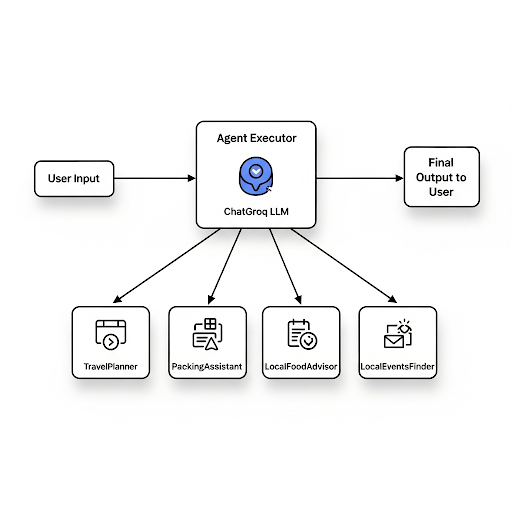
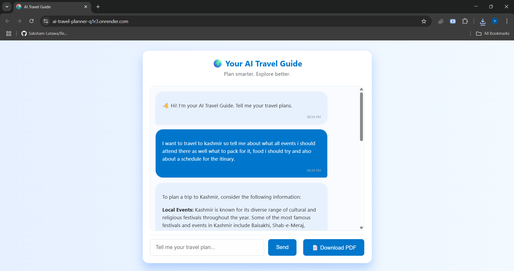
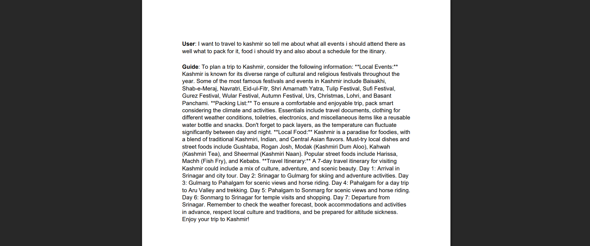

# 🌍 IntelliTrip — Your AI-Powered Travel Planner 

**IntelliTrip** is an intelligent, interactive travel planning assistant built with **FastAPI** and **LangChain Agents**, leveraging the **Groq API** for lightning-fast LLM responses. It helps users with end-to-end trip planning: from itinerary creation and packing lists to local food and event recommendations — all in a sleek web UI.


---

## ✨ Features

- **Conversational Agent**: Powered by LangChain + Groq API for natural travel conversations.
- **Smart Itinerary Planning**: Suggests destinations, activities, and routes.
- **Packing Assistant**: Personalized packing lists based on the location and travel type.
- **Food & Local Recommendations**: Get local cuisine suggestions & restaurant ideas.
- **Events Finder**: Discover local events and cultural activities.
- **Clean UI/UX**: Minimal, mobile-friendly chat interface with typing indicators.
- **Auto Deployment**: CI via GitHub Actions.
- **Dockerized**: Containerized for MLOps practice (optional, not used in production).
- **Testable Backend**: Ready for Pytest integration and extensible APIs.

---

## Screenshots

### 🗺️ Workflow


### 🧭 Chat Interface


### 🗺️ Pdf Sample



---

## Tech Stack

| Layer         | Tech |
|---------------|------|
| LLM Agent   | LangChain + Groq API |
| Backend     | FastAPI, Pydantic     |
| Frontend    | HTML + CSS + JS (Vanilla) |
| Deployment  | Render.com            |
| CI/CD       | GitHub Actions        |
| Dockerized  | For practice / MLOps  |
| CORS        | FastAPI Middleware    |

---

## Getting Started

### Local Setup

```bash
git clone https://github.com/knight22-21/intellitrip.git
cd intellitrip

# Create a virtual environment
python -m venv env
source env/bin/activate  # or .\env\Scripts\activate on Windows

# Install backend dependencies
pip install -r requirements.txt

# Run the app
uvicorn main:app --reload
````

### Access

Open browser and go to:
[http://localhost:8000](http://localhost:8000)

---

## Project Structure

```
intellitrip/
.
├── .github/
│   └── workflows/
│       └── deploy.yaml
├── backend/
│   ├── agents/
│   │   └── chat_agent.py
│   ├── config/
│   │   └── settings.py
│   ├── pdf_utils/
│   │   └── pdf_generator.py
│   ├── routes/
│   │   ├── __init__.py
│   │   └── routes.py
│   ├── main.py
│   └── requirements.txt
├── frontend/
│   ├── index.html
│   ├── script.js
│   └── style.css
├── tests/
│   ├── conftest.py
│   └── test_routes.py
├── .dockerignore
├── .gitignore
├── Dockerfile
├── LICENSE
└── README.md
```

---

## CI/CD with GitHub Actions

Includes a basic GitHub Actions workflow for:

* Code linting & formatting
* API test trigger
* Docker image build (for practice)
* Logs are saved to `/logs/app.log`

---

## Coming Soon

* Map integration (Google Maps or Leaflet.js)
* Exportable itinerary (PDF or .ics)
* Travel checklist editor
* Unit testing with Pytest

---

## Built with

* [FastAPI](https://fastapi.tiangolo.com/)
* [LangChain](https://www.langchain.com/)
* [Groq API](https://groq.com/)
* [Render](https://render.com/)
* [GitHub Actions](https://github.com/features/actions)
* [Docker](https://www.docker.com/)

---

## 👨‍💻 Author

**Knight** — [@YourGitHub](https://github.com/knight22-21)

---

## 📜 License

This project is licensed under the [MIT License](LICENSE).
